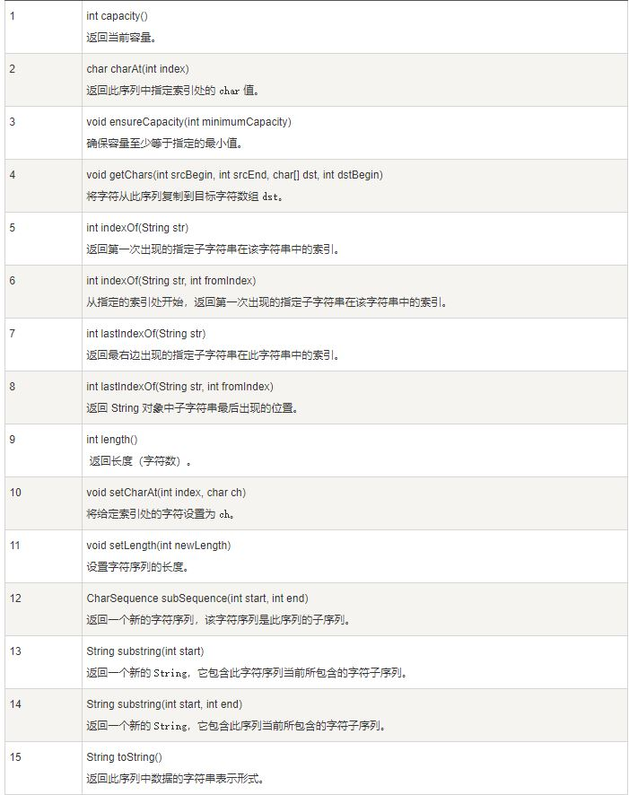

# Java StringBuffer 和 StringBuilder 类

当对字符串进行修改的时候，需要使用 StringBuffer 和 StringBuilder 类。

和 String 类不同的是，StringBuffer 和 StringBuilder 类的对象能够被多次的修改，并且不产生新的未使用对象。

StringBuilder 类和 StringBuffer 之间的最大不同在于 StringBuilder 的方法不是线程安全的，但是 StringBuilder 比 StringBuffer 操作更快。

所以，需要线程安全的时候 StringBuffer ，没有线程安全的情况下使用 StringBuilder

```java
public class Test{
  public static void main(String args[]){
    StringBuffer sBuffer = new StringBuffer("菜鸟教程官网：");
    sBuffer.append("www");
    sBuffer.append(".runoob");
    sBuffer.append(".com");
    System.out.println(sBuffer);  
  }
}
```
结果
```
菜鸟教程官网：www.runoob.com
```

# StringBuffer 方法


和 String 类的方法类似的方法：

