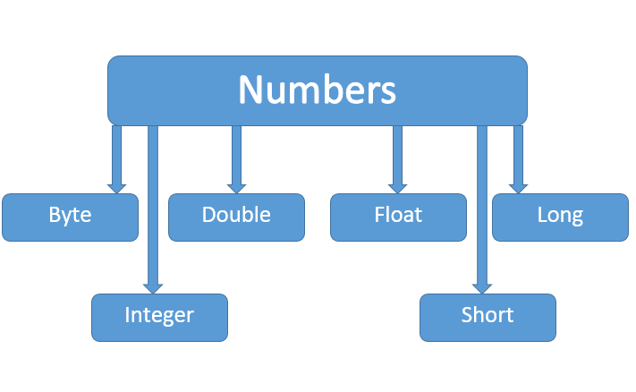

# Number类


如上图，**所有的包装类 Integer、Long、Byte、Double、Float、Short**都是抽象类 Number 的子类。

这种由编译器特别支持的包装称为**装箱**，所以当内置数据类型被当作对象使用的时候，编译器会把内置类型装箱为包装类。相似的，编译器也可以把一个对象**拆箱**为内置类型。Number 类属于 java.lang 包。

示例：
```java
public class Test{
 
   public static void main(String args[]){
      Integer x = 5;
      x =  x + 10;
      System.out.println(x); 
   }
}
```
```
运行结果
15
```

# Math 类
Java 的 Math 包含了用于执行**基本数学运算的属性和方法**，如初等指数、对数、平方根和三角函数。

Math 的方法都被定义为**static**形式，通过 Math 类可以在主函数中直接调用。

示例：
```java
public class Test {  
    public static void main (String []args)  
    {  
        System.out.println("90 度的正弦值：" + Math.sin(Math.PI/2));  
        System.out.println("0度的余弦值：" + Math.cos(0));  
        System.out.println("60度的正切值：" + Math.tan(Math.PI/3));  
        System.out.println("1的反正切值： " + Math.atan(1));  
        System.out.println("π/2的角度值：" + Math.toDegrees(Math.PI/2));  
        System.out.println(Math.PI);  
    }  
}
```
```
运行结果
90 度的正弦值：1.0
0度的余弦值：1.0
60度的正切值：1.7320508075688767
1的反正切值： 0.7853981633974483
π/2的角度值：90.0
3.141592653589793
```

# Number & Math 类方法
| 函数 | 功能 | 返回值意义 |
| --- | --- | --- |
| XXXValue() | 将Number对象转换为XXX类型，eg：DoubleValue 
| compareTo() | 比较大小 | 比形参小返回-1，大返回1，相等0 |
| equals() | 是否与参数相等 | 相等返回true，不相等返回false |
| valueOf() | 类似 python 的int(string base=) | 与对象一致的值 |
| toString() | 以字符串形式返回值。
| parseXXX() | 将字符串解析为XXX类型。
| abs() | 绝对值 
| ceil() | 向上取整 
| floor() | 向下取整 
| rint() | 取最接近的整数，返回类型为double 
| round() | 四舍五入，即加上0.5向下取整 
| min() | 同C艹
| max() | 同C艹
| exp() | e^x 
| log() | 自然对数
| pow() | 同C艹
| sqrt() | 同C艹
| sin() | 同C艹(注意三角函数都是对double用的)
| cos() | 同C艹
| tan() | 同C艹
| asin() | 同C艹
| acos() | 同C艹
| atan() | 同C艹
| atan2() | 将坐标转换成极坐标，返回极角
| toDegrees() | 转换成角度
| toRadians() | 转换成弧度
| random() | 返回[0, 1)随机数

