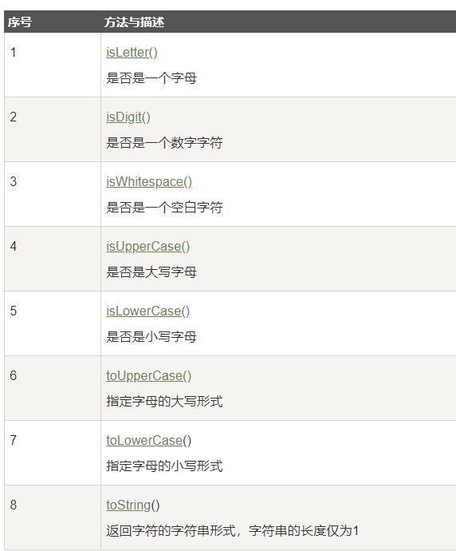

# Charater 类
Character 类用于对单个字符进行操作。

Character 类在对象中包装一个基本类型 char 的值

将一个char类型的参数传递给需要一个Character类型参数的方法时，那么编译器会**自动地**将char类型参数**转换为**Character对象。 这种特征称为**装箱**，反过来称为**拆箱**。

示例
```java
// 原始字符 'a' 装箱到 Character 对象 ch 中
Character ch = 'a';
 
// 原始字符 'x' 用 test 方法装箱
// 返回拆箱的值到 'c'
char c = test('x');
```

# 转义序列

同C艹

|转义符|功能|
|---|---|
|\t|tab|
|\b|回退|
|\n|换行|
|\r|回车|
|\f|换页|
|\'|单引号|
|\"|双引号|
|\\|反斜杠|

# Charater 方法
