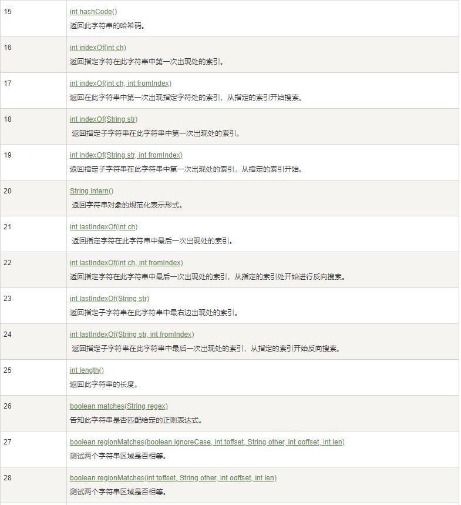
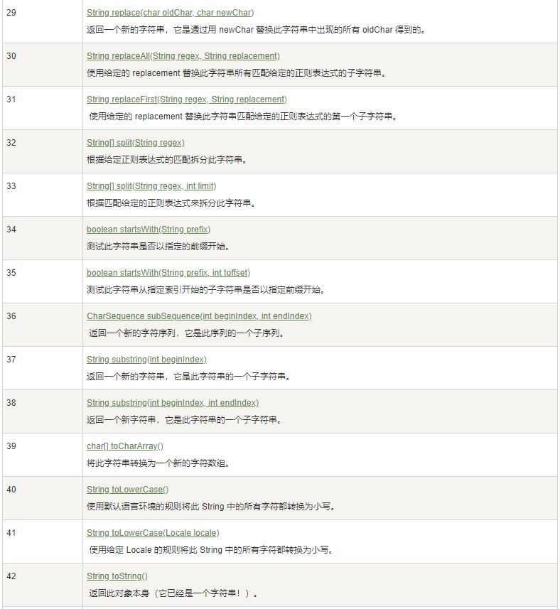

# String 类

String 类有**11 种**构造方法，这些方法提供不同的参数来初始化字符串, 可参考<https://docs.oracle.com/en/java/javase/11/docs/api/java.base/java/lang/String.html>

# 字符串长度

String 类的一个访问器方法是 length() 方法，它返回字符串对象包含的字符数。

例如
```java
public class StringDemo {
    public static void main(String args[]) {
        String site = "www.runoob.com";
        int len = site.length();
        System.out.println( "菜鸟教程网址长度 : " + len );
   }
}
```
输出
```
菜鸟教程网址长度 : 14
```

# 连接字符串

String 类提供了 concat 方法用于连接，或者直接使用+
```java
public class StringDemo {
    public static void main(String args[]) {     
        String string1 = "菜鸟教程网址：";     
        System.out.println(string1 + "www.runoob.com\n");  
        System.out.println("我的名字是 ".concat("Runoob"));
    }
}
```
输出
```
1、菜鸟教程网址：www.runoob.com
我的名字是 Runoob
```

# 创建格式化字符串

输出格式化数字可以使用 printf() 和 format() 方法。

String 类使用静态方法 format() 返回一个String 对象而不是 PrintStream 对象。

format() 能用来创建可复用的格式化字符串，而不仅仅是用于一次打印输出。

例如
```java
System.out.printf("浮点型变量的值为 " +
                  "%f, 整型变量的值为 " +
                  " %d, 字符串变量的值为 " +
                  "is %s", floatVar, intVar, stringVar);
String fs;
fs = String.format("浮点型变量的值为 " +
                   "%f, 整型变量的值为 " +
                   " %d, 字符串变量的值为 " +
                   " %s", floatVar, intVar, stringVar);
```


# String 方法







更多参考<https://docs.oracle.com/en/java/javase/11/docs/api/java.base/java/lang/String.html>